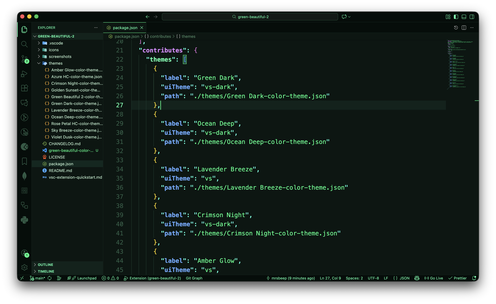
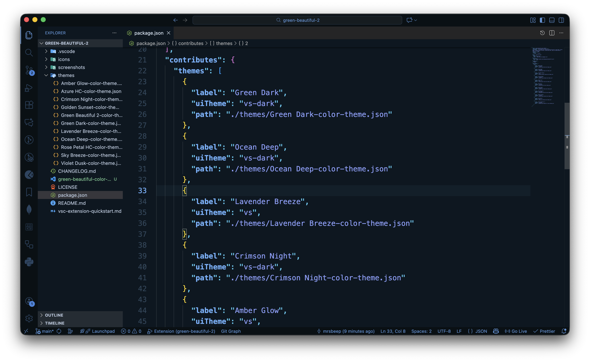
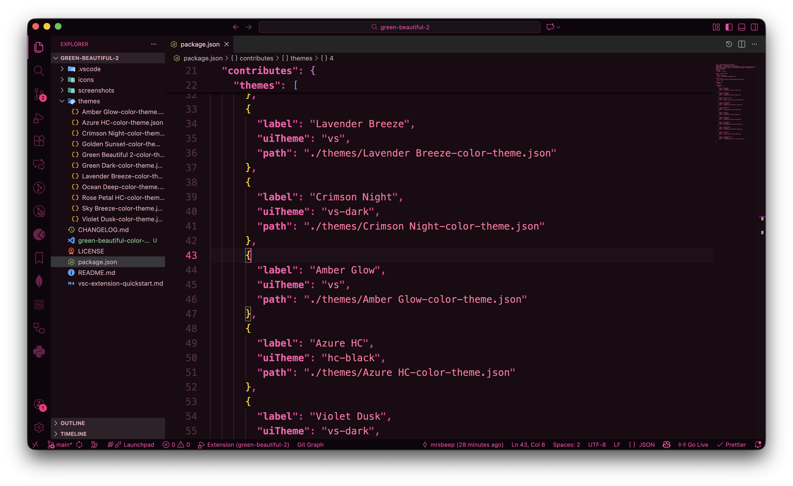
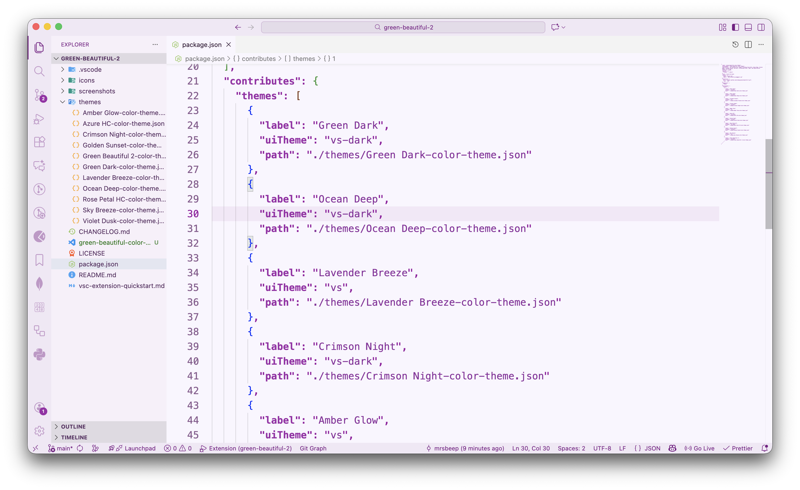
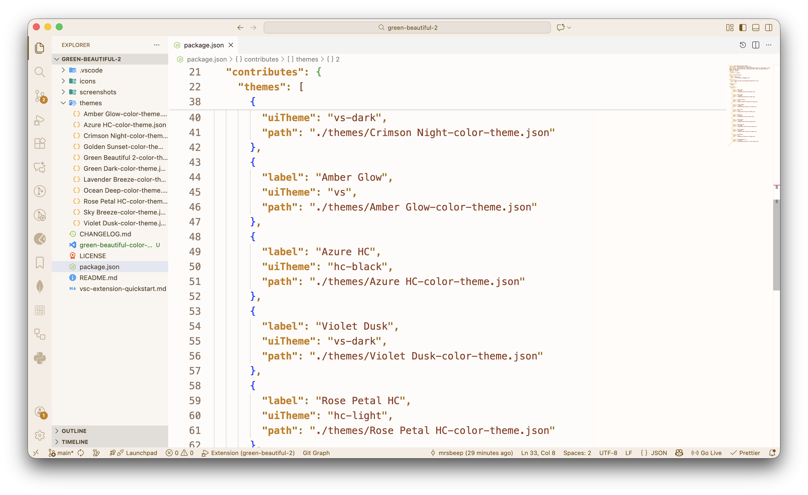
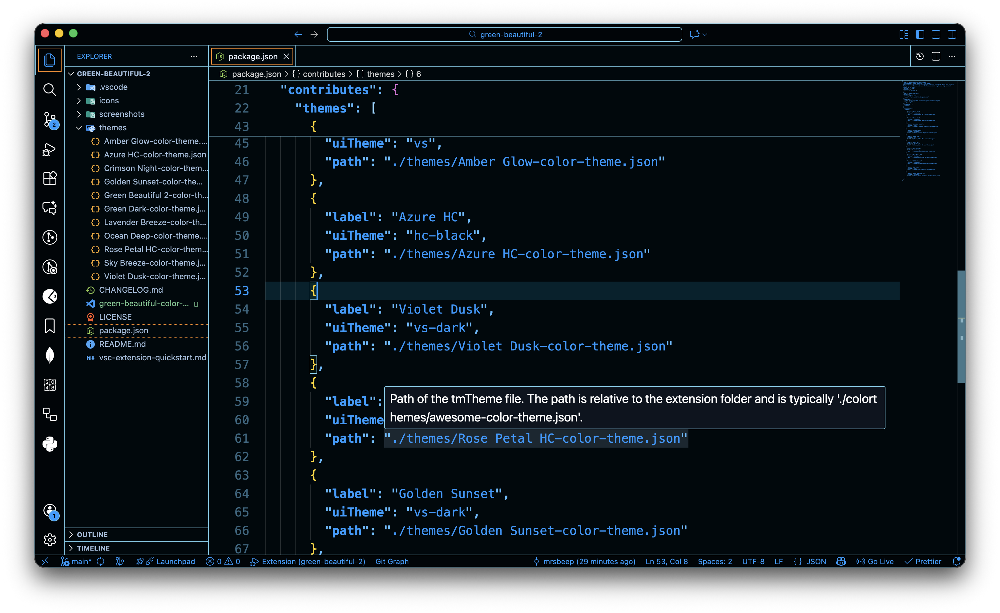
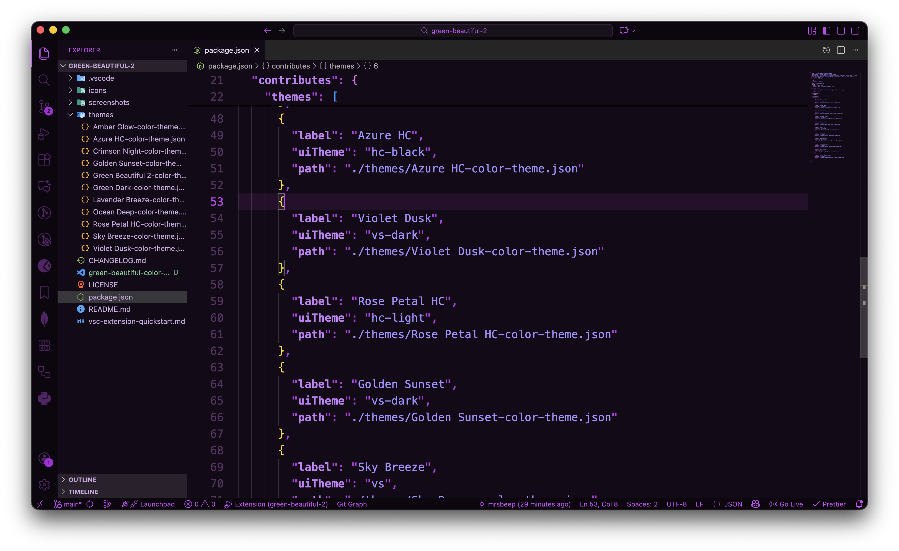
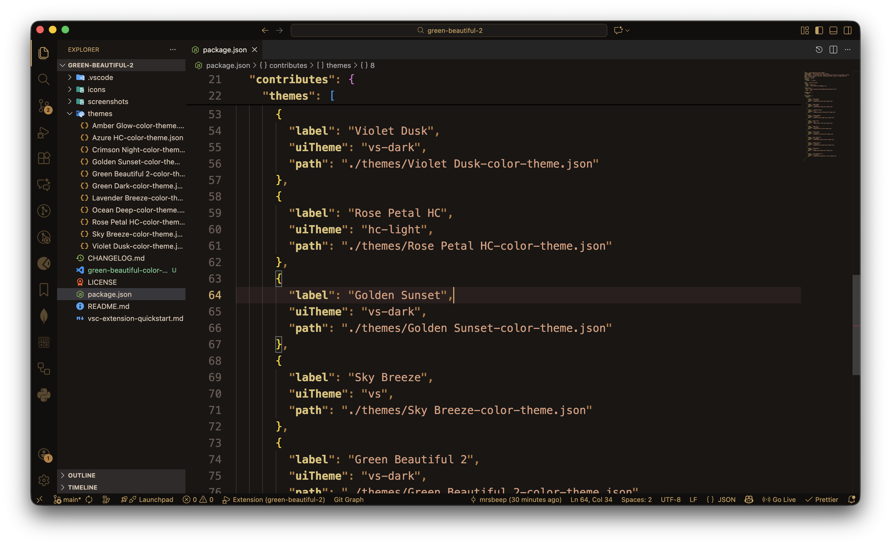
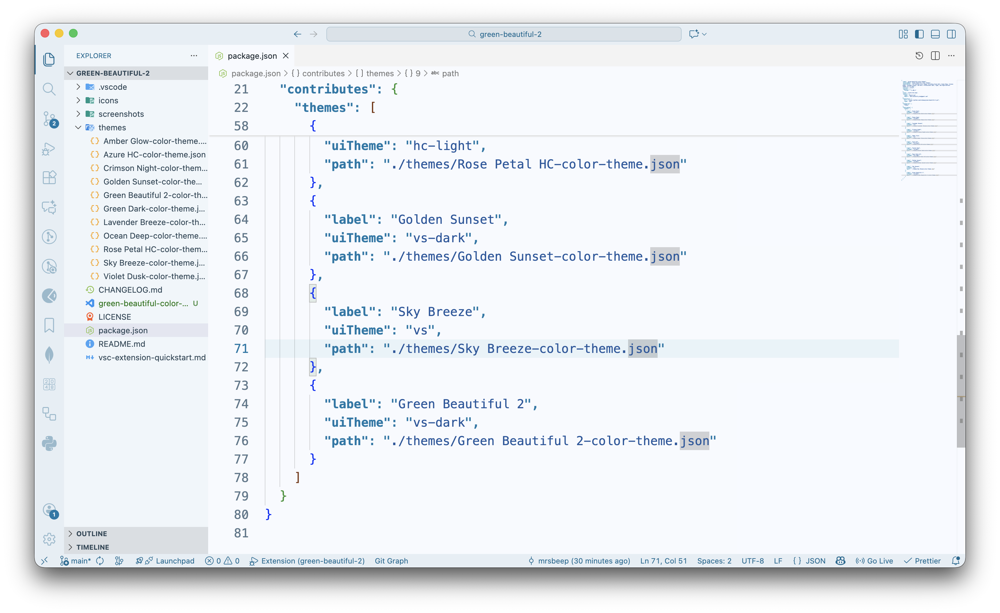
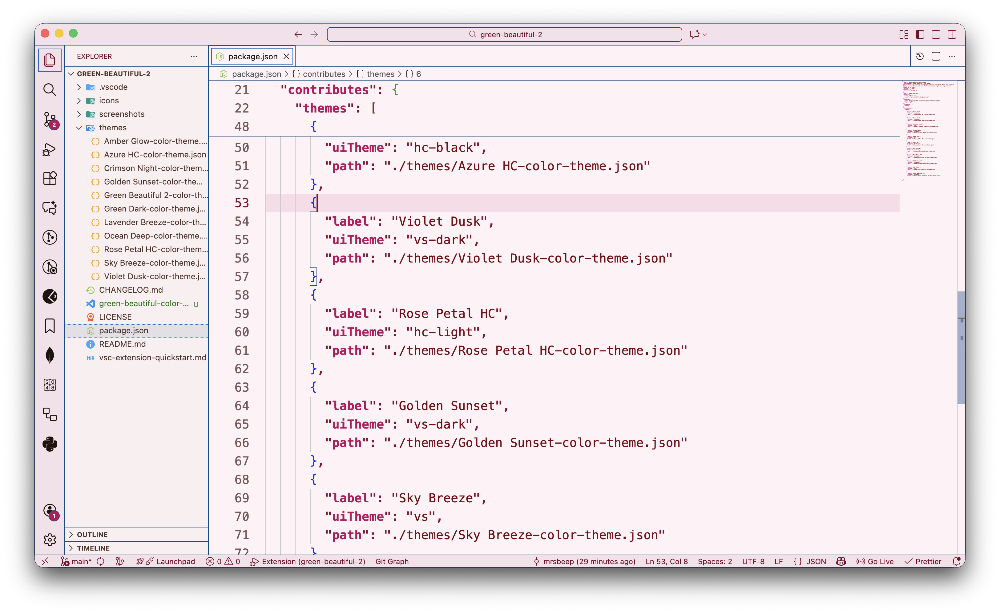

# Green Beautiful Color Themes

[](https://marketplace.visualstudio.com/items?itemName=davidleedarkbutterflydev.green-beautiful-color-themes)
[](https://marketplace.visualstudio.com/items?itemName=davidleedarkbutterflydev.green-beautiful-color-themes)
[](https://marketplace.visualstudio.com/items?itemName=davidleedarkbutterflydev.green-beautiful-color-themes)

A collection of 11 stunning color themes for Visual Studio Code, designed to enhance your coding experience with beautiful, eye-friendly colors. Whether you prefer dark, light, or high-contrast themes, this extension has something for everyone.

## ✨ Features

- 🌙 **7 Dark Themes** - Perfect for late-night coding sessions
- ☀️ **2 Light Themes** - Easy on the eyes during the day
- 🎯 **2 High Contrast Themes** - Enhanced visibility and accessibility
- 🎨 **Carefully Crafted Colors** - Each theme is designed with attention to detail
- 👁️ **Eye-Friendly** - Balanced contrast and color saturation
- 🔧 **Professional** - Suitable for all programming languages

## 🎨 Theme Gallery

### Green Beautiful 2

The signature theme with balanced green tones for a comfortable coding experience.


### Green Dark

A soothing dark theme with green accents that reduce eye strain.



### Ocean Deep

Immerse yourself in deep blue oceanic colors for calm and focused coding.



### Crimson Night

A rich dark theme with crimson highlights that add warmth to your editor.



### Lavender Breeze

A soft light theme with gentle lavender tones, perfect for daytime coding.



### Amber Glow

Warm light theme with amber highlights that create a cozy coding atmosphere.



### Azure HC

High contrast dark theme with azure accents for maximum readability.



### Violet Dusk

Elegant dark theme with sophisticated violet accents.



### Golden Sunset

Warm dark theme with golden hues inspired by beautiful sunsets.



### Sky Breeze

Cool dark theme with refreshing sky blue tones.



### Rose Petal HC

High contrast theme with delicate rose pink tones for enhanced visibility.



## 📦 Installation

### From VS Code Marketplace

1. Open **Extensions** sidebar panel in VS Code (`Ctrl+Shift+X` or `Cmd+Shift+X` on Mac)
2. Search for `Green Beautiful Color Themes`
3. Click **Install**
4. Click **Reload** to reload your editor
5. Navigate to `File > Preferences > Theme > Color Theme` (or `Code > Preferences > Theme > Color Theme` on Mac)
6. Select one of the Green Beautiful themes

### From Command Line

```bash
code --install-extension green-beautiful-color-themes
```

### Manual Installation

1. Download the latest `.vsix` file from [GitHub Releases](https://github.com/mrsbeep/green-beautiful-2/releases)
2. Open VS Code
3. Go to Extensions view (`Ctrl+Shift+X` or `Cmd+Shift+X`)
4. Click `...` at the top of the Extensions view
5. Choose **Install from VSIX...**
6. Select the downloaded `.vsix` file

## 🚀 Activating a Theme

1. Press `Ctrl+K Ctrl+T` (Windows/Linux) or `Cmd+K Cmd+T` (Mac)
2. Select your preferred Green Beautiful theme from the list
3. Enjoy your new look!

**Pro Tip:** You can also use the Command Palette (`Ctrl+Shift+P` or `Cmd+Shift+P`) and type `Preferences: Color Theme` to access the theme picker.

## 🎯 Theme Categories

### Dark Themes (Perfect for Night Coding)

- Green Dark
- Green Beautiful 2
- Ocean Deep
- Crimson Night
- Violet Dusk
- Golden Sunset
- Sky Breeze

### Light Themes (Easy on the Eyes)

- Lavender Breeze
- Amber Glow

### High Contrast Themes (Enhanced Accessibility)

- Azure HC
- Rose Petal HC

## 🛠️ Customization

You can customize any theme to your liking by adding settings to your `settings.json` file:

```json
{
  "workbench.colorCustomizations": {
    "[Green Beautiful 2]": {
      "editor.background": "#1a1a1a"
    }
  },
  "editor.tokenColorCustomizations": {
    "[Green Beautiful 2]": {
      "comments": "#6A9955"
    }
  }
}
```

## 🤝 Contributing

Contributions are welcome! If you have suggestions for improvements or find any issues:

1. Open an issue on [GitHub](https://github.com/mrsbeep/green-beautiful-2/issues)
2. Submit a pull request with your changes
3. Share your feedback and ideas

## 📝 Changelog

See [CHANGELOG.md](CHANGELOG.md) for a list of changes and version history.

## 📄 License

This extension is licensed under the [MIT License](LICENSE).

## 👤 Author

**David Lee**

- Email: dark.butterfly.dev@gmail.com
- GitHub: [@mrsbeep](https://github.com/mrsbeep)

## ⭐ Show Your Support

If you like these themes, please:

- ⭐ Star the [GitHub repository](https://github.com/mrsbeep/green-beautiful-2)
- ✍️ Leave a review on the [VS Code Marketplace](https://marketplace.visualstudio.com/items?itemName=green-beautiful-color-themes)
- 📢 Share with your friends and colleagues

## 🙏 Acknowledgments

Thank you to all the developers and designers in the VS Code community who inspire us to create better tools and themes.

---

**Enjoy coding with Green Beautiful Color Themes!** 🎨✨
